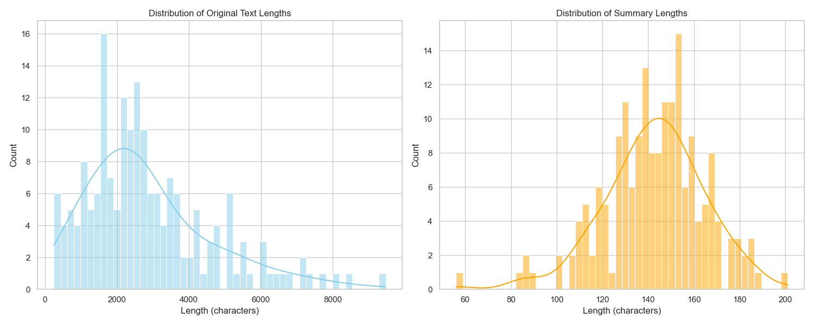

# Abstractive Summarization for Vietnamese Text

This project implements an abstractive summarization system for Vietnamese news articles using a fine-tuned Transformer model (ViT5). It includes a complete pipeline from data crawling, preprocessing, training, evaluation, to deployment via a REST API and a Chrome Extension.

## Features

*   **Data Collection**: Crawler for VnExpress articles (`vnexpress_crawler.py`).
*   **Preprocessing**: Text cleaning and dataset splitting (`preprocess.py`).
*   **Model Training**: Fine-tuning ViT5-base for summarization (`train.py`).
*   **Evaluation**: Comprehensive model evaluation with ROUGE scores and visualizations (`model_evaluation.ipynb`).
*   **API**: FastAPI backend for serving the model (`api/main.py`).
*   **Chrome Extension**: Browser extension to summarize articles directly on web pages (`extension/`).

## Data Visualization

The dataset consists of Vietnamese news articles and their summaries. Below is the distribution of text and summary lengths in the training set:



## Installation

1.  Clone the repository:
    ```bash
    git clone https://github.com/nibsu05/VN_Abs-Sum.git
    cd VN_Abs-Sum
    ```

2.  Create and activate a virtual environment:
    ```bash
    python -m venv venv
    # Windows
    venv\Scripts\activate
    # Linux/Mac
    source venv/bin/activate
    ```

3.  Install dependencies:
    ```bash
    pip install -r requirements.txt
    ```

## Usage

### 1. Data Preparation
To crawl new data (optional):
```bash
python vnexpress_crawler.py
```
To preprocess the data:
```bash
python preprocess.py
```

### 2. Training
To train the model:
```bash
python train.py
```
The trained model will be saved in `models/summarizer`.

### 3. Evaluation
To generate predictions on the test set:
```bash
python evaluate_model.py
```
To run the evaluation notebook, open `model_evaluation.ipynb` in Jupyter/VS Code.

### 4. Running the API
Start the FastAPI server:
```bash
python api/main.py
```
The API will be available at `http://localhost:8000`.

### 5. Chrome Extension
1.  Open Chrome and go to `chrome://extensions/`.
2.  Enable "Developer mode".
3.  Click "Load unpacked" and select the `extension` folder from this project.
4.  Navigate to a news article and click the extension icon to summarize.

## Model Performance

The model is evaluated using ROUGE metrics. Detailed performance analysis including ROUGE-1, ROUGE-2, and ROUGE-L scores can be found in the `results/` directory and the evaluation notebook.

## Project Structure

```
.
├── api/                    # FastAPI backend
├── data/                   # Data directory (raw & processed)
├── extension/              # Chrome extension source code
├── models/                 # Saved models (not committed to git)
├── results/                # Evaluation results and predictions
├── check_gpu.py           # Utility to check GPU availability
├── evaluate_model.py      # Script to generate predictions
├── model_evaluation.ipynb # Analysis notebook
├── preprocess.py          # Data preprocessing script
├── train.py               # Training script
├── vnexpress_crawler.py   # Data crawler
└── requirements.txt       # Python dependencies
```
